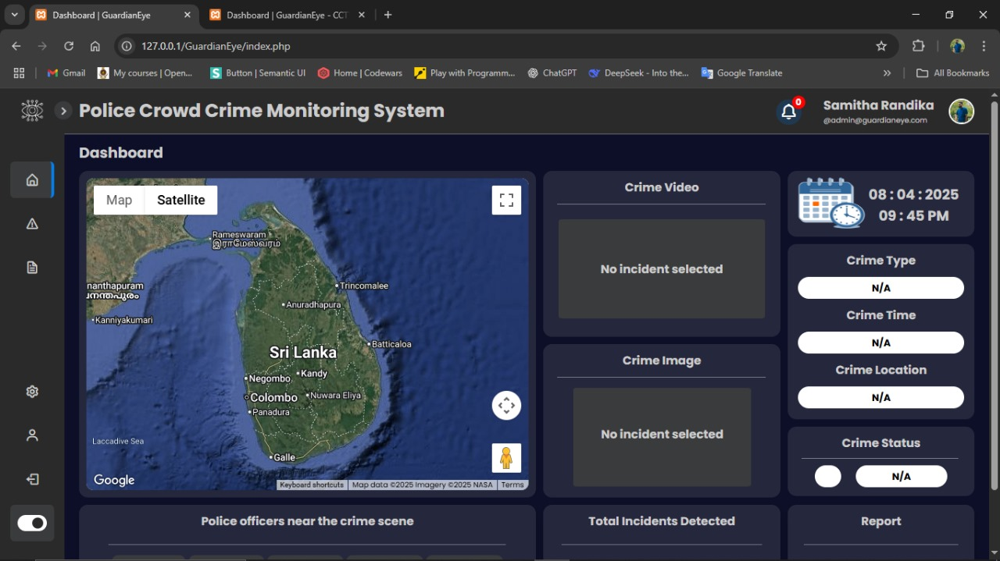
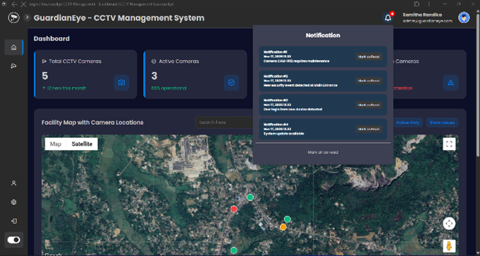
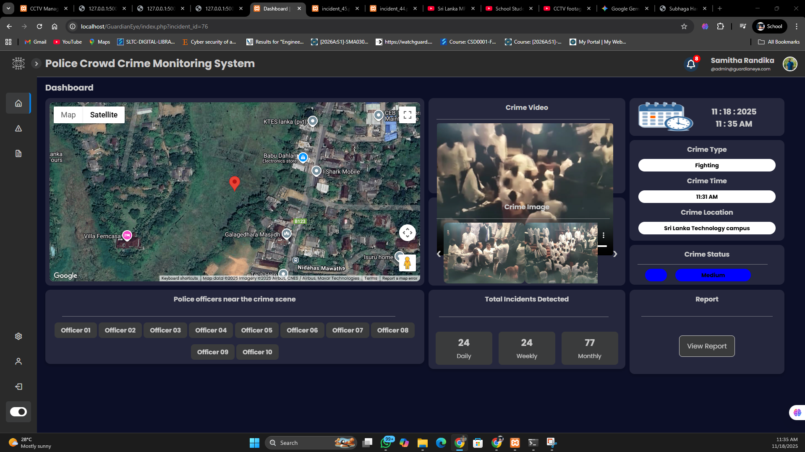

# 🔍 GuardianEye – AI Server
### IoT Enabled Smart Crowd Crime Monitoring System Using AI  
**Final Year Project | Batch 2026A**

GuardianEye is an AI + IoT powered real-time crime detection system designed to identify violence, robbery, fighting, and gun-related threats in crowded areas such as railway stations, airports, bus stands, and shopping malls.

This repository contains the **AI server** responsible for:
- Processing CCTV / IoT camera video streams
- Detecting violence vs non-violence
- Identifying crime types
- Communicating alerts to the police dashboard
- Handling multiple CCTV camera inputs in real time

---

# 🧠 Features

### ✔ Violence vs Non-Violence Detection  
Powered by **YOLOv8** trained on a custom Roboflow dataset.

### ✔ Crime Type Classification  
- **Fighting Detection** → RWF2000 + custom dataset used RNN model 
- **Gunshot Detection** → YOLOv8 object detection model  
- **Robbery / Shoplifting Detection** → CNN-based model trained on Kaggle dataset  

### ✔ Multi-Camera CCTV Management  
- Each camera has ID, location, latitude/longitude  
- Real-time processing of multiple live video feeds  

### ✔ IoT Integration  
Using **DroidCam** and custom streaming pipeline for real-time capture.

### ✔ REST API for Dashboard  
The AI server sends crime alerts instantly to the GuardianEye dashboard:
- Crime type  
- Confidence score  
- Timestamp  
- Camera ID  
- Location  

---
## 📸 Dashboard Screenshots

### 🔹 Main Dashboard View


### 🔹 Live Camera Feed


### 🔹 Crime Alert Popup


---

# 📂 Project Structure

- CRIMEANALYSIS_AI
  - vscode/
  - screenshots/
  - venv/
  - .gitignore
  - ai_server.py
  - README.md
  - requirements.txt
  - test_cam.py


---
# 🏗️ System Architecture

- IoT / CCTV Camera
↓
AI Server (YOLOv8 + CNN Models)
↓
Prediction (Violence / Crime Type)
↓
Database (MySQL)
↓
GuardianEye Dashboard

---

# ⚙️ Installation & Setup

## 1️⃣ Create virtual environment
```bash
python -m venv venv
source venv/bin/activate      # Linux/Mac
venv\Scripts\activate         # Windows
```

## 2️⃣ Start the AI Server
```bash
python ai_server.py
```

## 3️⃣ Test the Camera Feed
```bash
python test_cam.py


